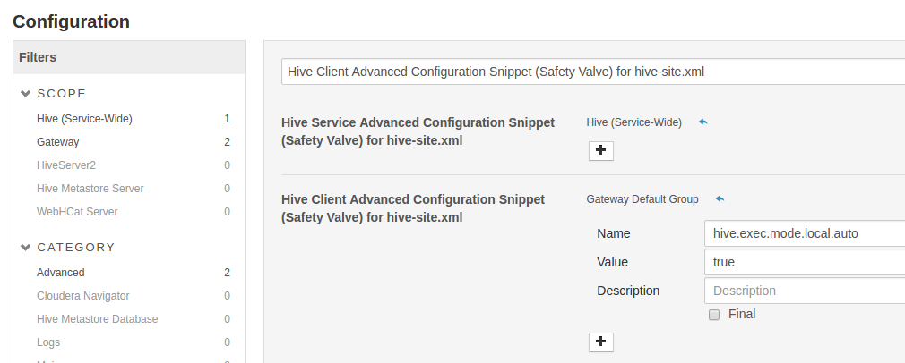

# ATSD Hive Storage Handler

The **ATSD Hive Storage Handler** allows Hive users to query data from [Axibase Time Series Database](http://axibase.com/products/axibase-time-series-database/)

## Contributions

ATSD Hive Storage Handler is a fork of [HiveJdbcStorageHandler](https://github.com/qubole/Hive-JDBC-Storage-Handler)

## Installation

## Download Option

Download [jar file](https://github.com/axibase/Hive-JDBC-Storage-Handler/releases/download/0.0.6/axibase-hive-JDBC-0.0.6.jar)

## Build Option

Download the code from Github

```
  $ git clone https://github.com/axibase/Hive-JDBC-storage-Handler.git
  $ cd Hive-JDBC-storage-Handler
```

Build the project with Maven. Add ```-DskipTests``` to build the project without running tests.

```
  $ mvn clean install -Phadoop-1 -DskipTests
```

The JARs for the storage handler can be found in the ```target/``` folder. Use ```axibase-hive-JDBC-0.0.6.jar```.

## Deployment

* Copy `axibase-hive-JDBC-0.0.6.jar` file to `/usr/lib/hive/lib/` directory

```
sudo cp axibase-hive-JDBC-0.0.6.jar /usr/lib/hive/lib/
```

* Download latest version of atsd-jdbc-driver [jar file](https://github.com/axibase/atsd-jdbc/releases/download/RELEASE-1.2.11/atsd-jdbc-1.2.12-DEPS.jar) with dependencies and copy it to `/usr/lib/hadoop-mapreduce/lib/` directory.

```
sudo cp atsd-jdbc-1.2.12-DEPS.jar /usr/lib/hadoop-mapreduce/lib/
```

* Enable hive.exec.mode.local.auto setting via `Hive Client Advanced Configuration Snippet (Safety Valve) for hive-site.xml` in Cloudera Manager Hive Configuration.




## Define Tables

```
hive> DROP TABLE disk_used;
hive> CREATE EXTERNAL TABLE disk_used
      row format serde 'org.apache.hadoop.hive.jdbc.storagehandler.JdbcSerDe'
      STORED BY 'org.apache.hadoop.hive.jdbc.storagehandler.JdbcStorageHandler'
      TBLPROPERTIES (
        "mapred.jdbc.driver.class"="com.axibase.tsd.driver.jdbc.AtsdDriver",
        "mapred.jdbc.url"="jdbc:axibase:atsd:https://10.102.0.6:8443/api/sql\;trustServerCertificate=true",
        "mapred.jdbc.username"="axibase",
        "mapred.jdbc.password"="********",
        "mapred.jdbc.input.table.name"="'df.disk_used'",
        "mapred.jdbc.output.table.name"="'df.disk_used'",
        "mapred.jdbc.hive.lazy.split"= "true"
      );
```


## Query Tables

```sql
hive> SELECT * FROM disk_used  LIMIT 1;

|--------------|---------------------|-----|-------|----------| 
| nurswgvml006 | 2016-02-05 15:43:01 | 0.0 | tmpfs | /dev/shm | 
|--------------|---------------------|-----|-------|----------| 
```

```sql
hive> SELECT value, `tags$mount_point`, datetime  
          FROM disk_used 
        WHERE entity = 'nurswgvml301' 
          LIMIT 1;

|-------|------|---------------------| 
| 704.0 | /run | 2016-08-25 10:43:26 | 
|-------|------|---------------------| 
```


```sql
hive> SELECT value, datetime 
          FROM disk_used 
        WHERE entity = 'nurswgvml301' AND `tags$mount_point`='/dev' 
          LIMIT 1;

|-----|---------------------| 
| 4.0 | 2016-08-25 10:43:26 | 
|-----|---------------------| 
```


```sql
hive> SELECT value, `tags$mount_point`, `tags$file_system` 
          FROM disk_used 
        WHERE entity = 'nurswgvml301' AND datetime > '2016-08-24T19:00:00.000Z' 
          LIMIT 10;

|-------|------|-------| 
| 704.0 | /run | tmpfs | 
| 704.0 | /run | tmpfs | 
| 704.0 | /run | tmpfs | 
| 700.0 | /run | tmpfs | 
| 700.0 | /run | tmpfs | 
| 700.0 | /run | tmpfs | 
| 700.0 | /run | tmpfs | 
| 700.0 | /run | tmpfs | 
| 700.0 | /run | tmpfs | 
| 700.0 | /run | tmpfs | 
|-------|------|-------| 
```


```sql
hive> SELECT value, `tags$mount_point`, `tags$file_system` 
          FROM disk_used 
        WHERE entity = 'nurswgvml301' 
          AND datetime > '2016-08-24T23:00:00.000Z' AND datetime <= '2016-08-25T10:45:00.000Z' order by value desc;

|-----------|----------------|-----------| 
| 1316576.0 | /              | /dev/sda1 | 
| 1316576.0 | /              | /dev/sda1 | 
| 1315536.0 | /              | /dev/sda1 | 
| 704.0     | /run           | tmpfs     | 
| 700.0     | /run           | tmpfs     | 
| 700.0     | /run           | tmpfs     | 
| 700.0     | /run           | tmpfs     | 
| 4.0       | /dev           | udev      | 
| 4.0       | /dev           | udev      | 
| 4.0       | /dev           | udev      | 
| 4.0       | /dev           | udev      | 
| 0.0       | /sys/fs/cgroup | none      | 
| 0.0       | /sys/fs/cgroup | none      | 
| 0.0       | /run/user      | none      | 
| 0.0       | /run/user      | none      | 
| ...       |                |           | 
| 0.0       | /run/shm       | none      | 
| 0.0       | /run/shm       | none      | 
| 0.0       | /run/shm       | none      | 
| 0.0       | /run/lock      | none      | 
| 0.0       | /run/lock      | none      | 
| 0.0       | /run/lock      | none      | 
|-----------|----------------|-----------| 
```

## Examples

* [Tables for metrics](examples.md#jdbcstoragehandler)
    * [Hive table for metric without tags](examples.md#hive-table-for-metric-without-tags)
    * [Hive table for metric with tags](examples.md#hive-table-for-metric-with-tags)
    * [Hive table for all metrics](examples.md#hive-table-for-atsd_series)
	
* [Tables for HBase](examples.md#hbasestoragehandler)
    * [Hive table for atsd_entity](examples.md#hive-table-for-atsd_entity)
    * [Hive table for atsd_metric](examples.md#hive-table-for-atsd_metric)
    * [Hive table for atsd_entity_group](examples.md#hive-table-for-atsd_entity_group)
    * [Hive table for atsd_entity_lookup](examples.md#hive-table-for-atsd_entity_lookup)
    * [Hive table for atsd_properties](examples.md#hive-table-for-atsd_properties)
